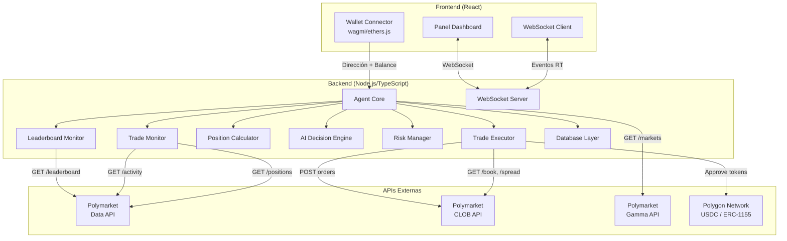
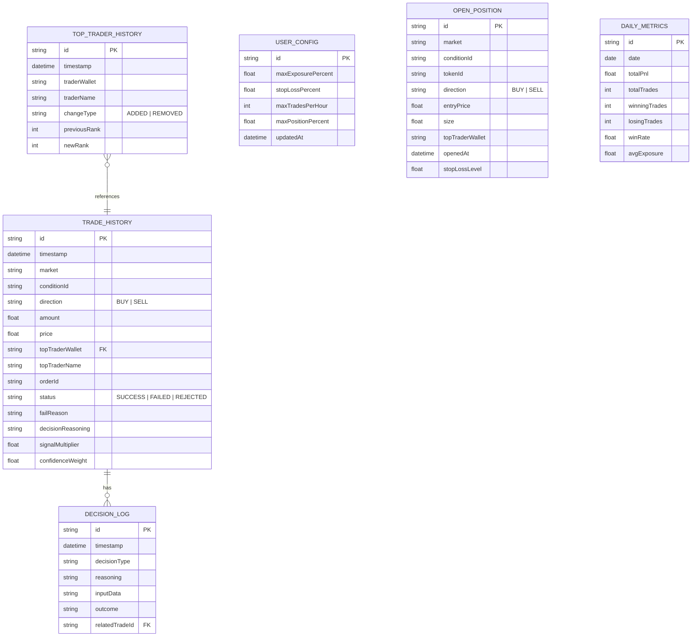

# Documento de Diseño — Polymarket Copy Trading Agent

## Resumen de Investigación

Se investigaron las APIs oficiales de Polymarket para informar este diseño:

- **Gamma API** (`gamma-api.polymarket.com`): Endpoints públicos para descubrimiento de mercados, metadatos de eventos, precios y búsqueda. Sin autenticación requerida. Rate limit ~10 req/s. [Docs](https://docs.polymarket.com/market-data/overview)
- **Data API** (`data-api.polymarket.com`): Leaderboard de traders por PnL, historial de trades por wallet, posiciones abiertas, actividad onchain. Sin autenticación para lectura. Rate limit ~30 req/s. [Docs](https://gist.github.com/shaunlebron/0dd3338f7dea06b8e9f8724981bb13bf)
- **CLOB API** (`clob.polymarket.com`): Libro de órdenes, precios, ejecución de trades. Autenticación L1 (EIP-712) y L2 (HMAC-SHA256) requerida para escritura. [Docs](https://docs.polymarket.com/trading/overview)
- **SDK oficial**: `@polymarket/clob-client-v2` para TypeScript, maneja firma de órdenes EIP-712, autenticación L1→L2, y envío de órdenes.

Hallazgos clave:
- El endpoint `GET /leaderboard` de la Data API devuelve traders rankeados por PnL realizado con parámetros `window`, `limit` y `offset`.
- El endpoint `GET /activity?user={address}` permite monitorear trades recientes de una wallet específica.
- El endpoint `GET /positions?user={address}` devuelve posiciones abiertas de una wallet.
- Las órdenes se firman con EIP-712 y se liquidan atómicamente en Polygon.
- El SDK maneja la derivación de credenciales API (L1→L2) automáticamente.

## Overview

El Polymarket Copy Trading Agent es un sistema compuesto por tres capas principales:

1. **Backend Agent Service** (Node.js/TypeScript): Servicio autónomo que monitorea el leaderboard, detecta operaciones de top traders, calcula posiciones proporcionales, aplica lógica de IA para decisiones inteligentes, gestiona riesgos y ejecuta órdenes a través de la CLOB API.

2. **Frontend Panel** (React): Interfaz web con tema oscuro futurista que muestra en tiempo real la actividad del agente, posiciones abiertas, métricas de rendimiento y permite la configuración de parámetros de riesgo. Se conecta al backend vía WebSocket.

3. **Base de Datos** (SQLite/PostgreSQL): Almacenamiento persistente para historial de operaciones, configuraciones del usuario, métricas de rendimiento y estado del agente.

El flujo principal es: Leaderboard API → Detección de Top Traders → Monitoreo de Trades → Cálculo Proporcional → Decisiones IA → Ejecución CLOB API → Notificación WebSocket → Panel UI.

## Architecture



### Decisiones de Arquitectura

1. **Polling vs WebSocket para monitoreo de trades**: Se usa polling con intervalo de 30s sobre la Data API (`GET /activity`) porque Polymarket no expone un WebSocket público para trades de terceros. El polling es suficiente dado que las operaciones de copy trading no requieren latencia sub-segundo.

2. **SQLite como base de datos por defecto**: Para simplicidad de despliegue (archivo único, sin servidor externo). Se puede migrar a PostgreSQL para producción. Se usa un ORM ligero (Prisma o Drizzle) para abstracción.

3. **Separación Agent Core / Trade Executor**: El Agent Core orquesta la lógica de decisión mientras el Trade Executor maneja exclusivamente la interacción con la CLOB API. Esto permite testear la lógica de decisión de forma aislada con mocks.

4. **WebSocket Server propio**: El backend expone un WebSocket server (ws/Socket.io) para push de eventos al frontend. Esto permite latencia <2s para notificaciones como requiere el Requisito 7.2.

5. **Autenticación CLOB via SDK**: Se usa `@polymarket/clob-client-v2` que maneja la derivación de credenciales L1→L2 y firma EIP-712 automáticamente, evitando implementar la criptografía manualmente.

## Components and Interfaces

### 1. Leaderboard Monitor (`LeaderboardMonitor`)

Responsable de consultar periódicamente la Data API para obtener y mantener la lista de top 10 traders.

```typescript
interface LeaderboardMonitor {
  // Inicia el polling cada 15 minutos
  start(): Promise<void>;
  stop(): void;

  // Obtiene la lista actual de top traders
  getTopTraders(): TopTrader[];

  // Evento emitido cuando cambia la lista
  on(event: 'traders-updated', handler: (changes: TraderChange[]) => void): void;
}

interface TopTrader {
  name: string;
  proxyWallet: string;
  pnl: number;
  volume: number;
  markets: number;
  rank: number;
  confidenceWeight: number;       // Peso basado en rendimiento reciente
  consecutiveLosses: number;      // Racha de pérdidas consecutivas
  lastUpdated: Date;
}

interface TraderChange {
  type: 'added' | 'removed';
  trader: TopTrader;
  previousRank?: number;
  timestamp: Date;
}
```

### 2. Trade Monitor (`TradeMonitor`)

Monitorea las operaciones de cada top trader mediante polling a la Data API.

```typescript
interface TradeMonitor {
  start(): Promise<void>;
  stop(): void;

  // Evento emitido cuando se detecta una nueva operación
  on(event: 'new-trade', handler: (trade: DetectedTrade) => void): void;
}

interface DetectedTrade {
  traderWallet: string;
  traderName: string;
  action: 'BUY' | 'SELL';
  market: string;
  conditionId: string;
  outcome: string;
  tokenId: string;
  amount: number;          // Cantidad en USDC
  price: number;
  timestamp: Date;
  tradeId: string;         // ID único para deduplicación
}
```

### 3. Position Calculator (`PositionCalculator`)

Calcula el tamaño proporcional de cada operación basado en el capital del usuario.

```typescript
interface PositionCalculator {
  // Calcula la posición proporcional
  calculateProportionalPosition(params: PositionCalcParams): PositionResult;
}

interface PositionCalcParams {
  tradeAmount: number;           // Cantidad de la operación del top trader
  traderEstimatedCapital: number; // Capital estimado del top trader
  userBalance: number;            // Balance USDC del usuario
  confidenceWeight: number;       // Peso de confianza del trader (0-1)
  signalMultiplier: number;       // Multiplicador por señal convergente (1.0-1.5)
}

interface PositionResult {
  amount: number;                 // Cantidad final en USDC
  wasLimited: boolean;            // Si se aplicó límite del 10%
  wasDiscarded: boolean;          // Si se descartó por < 1 USDC
  discardReason?: string;
  ratioCapital: number;           // Ratio usado en el cálculo
}
```

### 4. AI Decision Engine (`AIDecisionEngine`)

Implementa la lógica inteligente de decisiones más allá del simple copy trading.

```typescript
interface AIDecisionEngine {
  // Evalúa si ejecutar una operación y con qué parámetros
  evaluateTrade(context: TradeContext): Promise<TradeDecision>;

  // Actualiza métricas de rendimiento de un trader
  updateTraderPerformance(wallet: string, tradeResult: TradeResult): void;
}

interface TradeContext {
  detectedTrade: DetectedTrade;
  recentSignals: DetectedTrade[];   // Trades recientes en el mismo mercado
  traderProfile: TopTrader;
  marketSpread: number;
  userBalance: number;
  openPositions: Position[];
  riskLimits: RiskConfig;
}

interface TradeDecision {
  action: 'execute' | 'postpone' | 'discard';
  adjustedAmount?: number;
  signalMultiplier: number;
  reasoning: string;
  factors: DecisionFactor[];
  postponeUntil?: Date;
}

interface DecisionFactor {
  name: string;
  value: number | string;
  impact: 'positive' | 'negative' | 'neutral';
}
```

### 5. Risk Manager (`RiskManager`)

Gestiona límites de riesgo, stop-loss y restricciones operativas.

```typescript
interface RiskManager {
  // Verifica si se puede abrir una nueva posición
  canOpenPosition(amount: number, userBalance: number): RiskCheck;

  // Evalúa stop-loss para posiciones abiertas
  evaluateStopLoss(positions: Position[], currentPrices: Map<string, number>): StopLossAction[];

  // Verifica límite de operaciones por hora
  canExecuteTrade(): boolean;

  // Registra una operación ejecutada
  recordExecution(): void;
}

interface RiskConfig {
  maxExposurePercent: number;      // Default: 50%
  stopLossPercent: number;         // Default: 15%
  maxTradesPerHour: number;        // Default: 20
  maxPositionPercent: number;      // Default: 10%
  minTradeAmount: number;          // Default: 1 USDC
  minBalance: number;              // Default: 5 USDC
}

interface RiskCheck {
  allowed: boolean;
  reason?: string;
  currentExposure: number;
  maxExposure: number;
}

interface StopLossAction {
  positionId: string;
  market: string;
  currentLossPercent: number;
  action: 'close';
}
```

### 6. Trade Executor (`TradeExecutor`)

Interactúa con la CLOB API para ejecutar órdenes.

```typescript
interface TradeExecutor {
  // Ejecuta una orden en Polymarket
  executeOrder(order: OrderParams): Promise<OrderResult>;

  // Verifica aprobaciones de tokens
  checkApprovals(wallet: string): Promise<ApprovalStatus>;

  // Obtiene el spread actual de un mercado
  getMarketSpread(tokenId: string): Promise<number>;
}

interface OrderParams {
  tokenId: string;
  side: 'BUY' | 'SELL';
  price: number;
  size: number;
  conditionId: string;
}

interface OrderResult {
  success: boolean;
  orderId?: string;
  executedPrice?: number;
  executedSize?: number;
  error?: string;
  timestamp: Date;
}
```

### 7. WebSocket Server (`WebSocketServer`)

Transmite eventos en tiempo real al frontend.

```typescript
interface WebSocketServer {
  start(port: number): void;
  stop(): void;

  // Envía evento a todos los clientes conectados
  broadcast(event: WSEvent): void;
}

type WSEvent =
  | { type: 'trade-executed'; data: TradeExecutionEvent }
  | { type: 'traders-updated'; data: TraderChange[] }
  | { type: 'risk-alert'; data: RiskAlert }
  | { type: 'position-update'; data: PositionUpdate }
  | { type: 'balance-update'; data: BalanceUpdate }
  | { type: 'stop-loss-triggered'; data: StopLossEvent }
  | { type: 'agent-status'; data: AgentStatus };
```

## Data Models

### Esquema de Base de Datos



### Modelos TypeScript del Dominio

```typescript
// Operación de trading
interface TradeRecord {
  id: string;
  timestamp: Date;
  market: string;
  conditionId: string;
  direction: 'BUY' | 'SELL';
  amount: number;
  price: number;
  topTraderWallet: string;
  topTraderName: string;
  orderId: string | null;
  status: 'SUCCESS' | 'FAILED' | 'REJECTED';
  failReason: string | null;
  decisionReasoning: string;
  signalMultiplier: number;
  confidenceWeight: number;
}

// Configuración del usuario
interface UserConfig {
  id: string;
  maxExposurePercent: number;
  stopLossPercent: number;
  maxTradesPerHour: number;
  maxPositionPercent: number;
  updatedAt: Date;
}

// Posición abierta
interface Position {
  id: string;
  market: string;
  conditionId: string;
  tokenId: string;
  direction: 'BUY' | 'SELL';
  entryPrice: number;
  size: number;
  topTraderWallet: string;
  openedAt: Date;
  stopLossLevel: number;
}

// Métricas diarias
interface DailyMetrics {
  id: string;
  date: string;
  totalPnl: number;
  totalTrades: number;
  winningTrades: number;
  losingTrades: number;
  winRate: number;
  avgExposure: number;
}

// Respuesta del Leaderboard API
interface LeaderboardResponse {
  leaderboard: LeaderboardEntry[];
}

interface LeaderboardEntry {
  name: string;
  proxyWallet: string;
  pnl: number;
  volume: number;
  markets: number;
}

// Respuesta del Trade History API
interface TradeHistoryResponse {
  history: TradeHistoryEntry[];
}

interface TradeHistoryEntry {
  action: 'BUY' | 'SELL';
  market: string;
  outcome: string;
  amount: number;
  price: number;
  timestamp: string;
  conditionId: string;
  tokenId: string;
}
```


## Correctness Properties

*Una propiedad es una característica o comportamiento que debe mantenerse verdadero en todas las ejecuciones válidas de un sistema — esencialmente, una declaración formal sobre lo que el sistema debe hacer. Las propiedades sirven como puente entre especificaciones legibles por humanos y garantías de corrección verificables por máquinas.*

### Property 1: Reconciliación del Leaderboard

*Para cualquier* par de snapshots consecutivos del leaderboard (anterior y nuevo), la lista activa de traders monitoreados debe coincidir exactamente con los 10 primeros del nuevo snapshot. Los traders que salieron del top 10 deben ser eliminados de la lista activa, y los nuevos traders que entraron deben ser añadidos.

**Validates: Requirements 1.3, 1.4**

### Property 2: Completitud de datos en detección de trades

*Para cualquier* respuesta válida de la API de historial de trades, el trade detectado y registrado debe contener todos los campos requeridos: marca de tiempo, mercado, dirección (compra/venta), precio y cantidad. Ningún campo requerido puede ser nulo o estar ausente.

**Validates: Requirements 2.2**

### Property 3: Idempotencia en deduplicación de trades

*Para cualquier* trade detectado, procesarlo dos veces con el mismo tradeId debe producir exactamente un registro en el sistema. La segunda invocación no debe generar efectos secundarios adicionales (ni registros duplicados, ni órdenes duplicadas).

**Validates: Requirements 2.3**

### Property 4: Corrección del cálculo de posición proporcional

*Para cualquier* combinación válida de (montoTrade, capitalTrader, balanceUsuario, pesoConfianza, multiplicadorSeñal), el cálculo de la posición proporcional debe ser determinista: calcular dos veces con los mismos parámetros de entrada debe producir un resultado idéntico. Además, el resultado debe ser igual a `montoTrade * (balanceUsuario / capitalTrader) * pesoConfianza * multiplicadorSeñal`.

**Validates: Requirements 3.1, 3.6**

### Property 5: Invariantes del cálculo de posición

*Para cualquier* resultado del cálculo de posición proporcional: (a) si el resultado es inferior a 1 USDC, la operación debe ser descartada; (b) el resultado nunca debe superar el 10% del balance total del usuario. Estas restricciones deben mantenerse independientemente de los parámetros de entrada.

**Validates: Requirements 3.3, 3.4**

### Property 6: Enforcement del límite de exposición

*Para cualquier* conjunto de posiciones abiertas y una nueva operación propuesta, si la suma del capital expuesto en posiciones abiertas más la nueva operación supera el porcentaje máximo de exposición configurado, la nueva operación debe ser rechazada. El capital total expuesto nunca debe superar el límite configurado.

**Validates: Requirements 5.2**

### Property 7: Evaluación correcta de Stop-Loss

*Para cualquier* posición abierta con un precio de entrada y un precio actual, si la pérdida no realizada en porcentaje (`(precioEntrada - precioActual) / precioEntrada * 100`) alcanza o supera el porcentaje de Stop_Loss configurado, el sistema debe generar una acción de cierre para esa posición. Si la pérdida está por debajo del umbral, no debe generarse ninguna acción.

**Validates: Requirements 5.4**

### Property 8: Enforcement del límite de operaciones por hora

*Para cualquier* secuencia de marcas de tiempo de operaciones ejecutadas, si el número de operaciones dentro de la última hora alcanza o supera el límite configurado, el sistema debe rechazar nuevas operaciones. Si el número está por debajo del límite, las operaciones deben ser permitidas.

**Validates: Requirements 5.6**

### Property 9: Completitud del registro de decisiones

*Para cualquier* decisión de gestión de riesgos o decisión inteligente del agente de IA, el registro debe contener todos los campos requeridos: tipo de decisión, razonamiento, datos de entrada utilizados, resultado y marca de tiempo. Ningún campo requerido puede estar ausente.

**Validates: Requirements 5.7, 8.5**

### Property 10: Multiplicador de señal convergente

*Para cualquier* conjunto de trades detectados de diferentes Top_Traders en el mismo mercado y misma dirección dentro de una ventana de 5 minutos, si hay 2 o más trades convergentes, el multiplicador de señal debe ser mayor que 1.0 y no debe superar 1.5. Si solo hay 1 trade, el multiplicador debe ser exactamente 1.0.

**Validates: Requirements 8.1**

### Property 11: Reducción de confianza por racha perdedora

*Para cualquier* secuencia de resultados de operaciones de un Top_Trader, si las últimas 3 o más operaciones son perdedoras consecutivas, el peso de confianza para ese trader debe ser reducido al 50% de su valor base. Cuando el trader registra una operación ganadora, el peso debe restaurarse.

**Validates: Requirements 8.2**

### Property 12: Enforcement del umbral de spread

*Para cualquier* valor de spread de un mercado, si el spread es superior al 5%, la operación debe ser pospuesta o descartada (tras 10 minutos de espera). Si el spread es igual o inferior al 5%, la operación debe proceder normalmente.

**Validates: Requirements 8.4**

### Property 13: Round-trip de serialización de objetos de operación

*Para cualquier* objeto de operación (TradeRecord) válido, serializarlo a JSON y luego deserializarlo desde JSON debe producir un objeto equivalente al original. Todos los campos, incluyendo tipos numéricos, fechas y strings, deben preservarse exactamente.

**Validates: Requirements 10.1, 10.2, 10.4**

### Property 14: Round-trip de serialización de configuración

*Para cualquier* objeto de configuración (UserConfig) válido, serializarlo a JSON y luego deserializarlo desde JSON debe producir un objeto equivalente al original. Esto aplica tanto para transmisión WebSocket como para almacenamiento en base de datos.

**Validates: Requirements 10.3, 10.5, 9.3**

## Error Handling

### Errores de APIs Externas

| Escenario | Comportamiento | Retry |
|-----------|---------------|-------|
| Leaderboard API no disponible | Mantener última lista válida, log del error | Retroceso exponencial, máx 5 min |
| Trade History API error para un trader | Log del error, continuar con otros traders | Siguiente ciclo de polling (30s) |
| CLOB API rechaza orden | Log del motivo, notificar al usuario | No reintentar automáticamente |
| CLOB API timeout | Log del error, marcar operación como fallida | No reintentar |
| JSON malformado de API | Log del contenido recibido, continuar operación | Siguiente ciclo de polling |
| Mercado no existe/no disponible | Omitir operación, log del motivo | No reintentar |

### Errores de Wallet

| Escenario | Comportamiento |
|-----------|---------------|
| Wallet desconectada | Pausar todas las operaciones, mostrar estado desconectado |
| Red incorrecta (no Polygon) | Solicitar cambio de red vía MetaMask |
| Balance insuficiente (< 5 USDC) | Pausar operaciones, notificar al usuario |
| Aprobaciones de tokens faltantes | Solicitar aprobación al usuario antes de operar |
| Conexión MetaMask rechazada | Mostrar mensaje de rechazo, permitir reintentar |

### Errores de WebSocket

| Escenario | Comportamiento |
|-----------|---------------|
| Conexión WebSocket perdida (cliente) | Mostrar indicador de desconexión, reintentar con retroceso exponencial (máx 30s) |
| Conexión WebSocket perdida (servidor) | Log del error, los clientes se reconectan automáticamente |

### Errores de Base de Datos

| Escenario | Comportamiento |
|-----------|---------------|
| Error de escritura en DB | Log del error, reintentar una vez, continuar operación |
| Error de lectura en DB | Log del error, usar valores por defecto si es configuración |
| DB corrupta al inicio | Log crítico, no iniciar el agente hasta resolución manual |

### Estrategia General de Logging

Todos los errores se registran con:
- Marca de tiempo (ISO 8601)
- Nivel de severidad (ERROR, WARN, INFO)
- Componente que generó el error
- Mensaje descriptivo
- Datos de contexto (sin datos sensibles como claves privadas)

## Testing Strategy

### Enfoque Dual de Testing

El proyecto utiliza un enfoque dual complementario:

1. **Tests unitarios (example-based)**: Para escenarios específicos, edge cases, integraciones con APIs externas y comportamiento de UI.
2. **Tests de propiedades (property-based)**: Para verificar propiedades universales que deben mantenerse para todas las entradas válidas.

### Librería de Property-Based Testing

Se utilizará **fast-check** (`fast-check`) para TypeScript/JavaScript, que es la librería PBT más madura del ecosistema Node.js.

**Configuración**:
- Mínimo **100 iteraciones** por test de propiedad
- Cada test debe referenciar la propiedad del documento de diseño
- Formato de tag: `Feature: polymarket-copy-trading-agent, Property {number}: {título}`

### Tests de Propiedades (14 propiedades)

| Propiedad | Componente | Generadores Necesarios |
|-----------|-----------|----------------------|
| P1: Reconciliación Leaderboard | LeaderboardMonitor | Listas aleatorias de traders con rankings |
| P2: Completitud datos trade | TradeMonitor | Respuestas API aleatorias con campos variados |
| P3: Idempotencia deduplicación | TradeMonitor | Trades aleatorios con IDs repetidos |
| P4: Cálculo posición correcta | PositionCalculator | Tuplas (monto, capital, balance, peso, multiplicador) |
| P5: Invariantes posición | PositionCalculator | Mismos generadores que P4 |
| P6: Límite exposición | RiskManager | Conjuntos de posiciones + nueva operación |
| P7: Stop-Loss correcto | RiskManager | Posiciones con precios de entrada y actuales aleatorios |
| P8: Límite operaciones/hora | RiskManager | Secuencias de timestamps en ventana de 1 hora |
| P9: Completitud registro decisiones | DecisionLogger | Decisiones aleatorias de riesgo e IA |
| P10: Multiplicador señal convergente | AIDecisionEngine | Conjuntos de trades con timestamps y mercados variados |
| P11: Reducción confianza racha | AIDecisionEngine | Secuencias de resultados (win/loss) |
| P12: Umbral spread | AIDecisionEngine | Valores de spread aleatorios (0-100%) |
| P13: Round-trip serialización trade | Serialization | Objetos TradeRecord aleatorios |
| P14: Round-trip serialización config | Serialization | Objetos UserConfig aleatorios |

### Tests Unitarios (Example-Based)

| Área | Tests |
|------|-------|
| Leaderboard API fallida | Verificar retención de última lista válida y retroceso exponencial |
| Error API para un trader | Verificar aislamiento de errores entre traders |
| Rechazo de orden CLOB | Verificar log del motivo y ausencia de retry |
| Aprobaciones faltantes | Verificar solicitud de aprobación al usuario |
| Mercado inexistente | Verificar omisión de operación |
| JSON malformado | Verificar log del error y continuidad del servicio |
| Wallet desconectada | Verificar pausa de operaciones |
| Red incorrecta | Verificar solicitud de cambio a Polygon |
| Balance < 5 USDC | Verificar pausa y notificación |
| Configuración por defecto | Verificar valores: 50% exposición, 15% stop-loss, 20 ops/hora |

### Tests de Integración

| Área | Tests |
|------|-------|
| Polling Leaderboard | Verificar intervalo de 15 minutos |
| Polling Trade History | Verificar intervalo de 30 segundos |
| WebSocket latencia | Verificar transmisión < 2 segundos |
| Persistencia DB | Verificar escritura y lectura de todos los modelos |
| Restauración de estado | Verificar carga correcta tras reinicio |
| Conexión MetaMask | Verificar flujo completo de conexión en Polygon |

### Tests de UI (Frontend)

| Área | Tests |
|------|-------|
| Dashboard rendering | Verificar presencia de todas las secciones |
| Notificaciones de trades | Verificar aparición con datos correctos |
| Indicador WebSocket | Verificar estados conectado/desconectado |
| Botón de wallet | Verificar flujo de conexión/desconexión |
| Datos de Top Traders | Verificar campos: nombre, beneficio, operaciones, estado |
| Datos de posiciones | Verificar campos: mercado, dirección, precios, P&L, stop-loss |

### Estructura de Tests

```
tests/
├── properties/           # Tests de propiedades (fast-check)
│   ├── leaderboard.property.test.ts
│   ├── position-calculator.property.test.ts
│   ├── risk-manager.property.test.ts
│   ├── ai-decision.property.test.ts
│   ├── serialization.property.test.ts
│   ├── trade-monitor.property.test.ts
│   └── decision-logger.property.test.ts
├── unit/                 # Tests unitarios
│   ├── leaderboard-monitor.test.ts
│   ├── trade-monitor.test.ts
│   ├── trade-executor.test.ts
│   ├── risk-manager.test.ts
│   └── wallet-connection.test.ts
├── integration/          # Tests de integración
│   ├── api-polling.test.ts
│   ├── websocket.test.ts
│   └── database.test.ts
└── generators/           # Generadores compartidos para fast-check
    ├── trade.generators.ts
    ├── trader.generators.ts
    ├── position.generators.ts
    └── config.generators.ts
```
